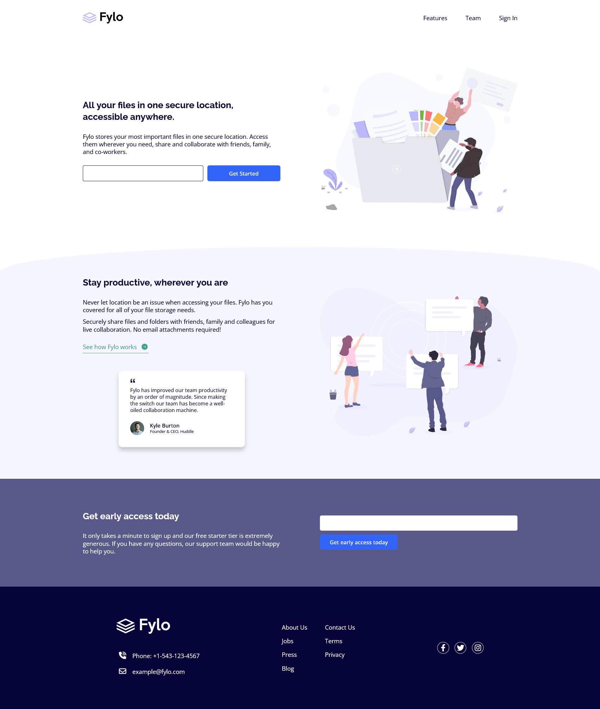

# Frontend Mentor - Fylo landing page with two column layout solution

This is a solution to the [Fylo landing page with two column layout challenge on Frontend Mentor](https://www.frontendmentor.io/challenges/fylo-landing-page-with-two-column-layout-5ca5ef041e82137ec91a50f5). Frontend Mentor challenges help you improve your coding skills by building realistic projects.

## Table of contents

- [Frontend Mentor - Fylo landing page with two column layout solution](#frontend-mentor---fylo-landing-page-with-two-column-layout-solution)
  - [Table of contents](#table-of-contents)
  - [Overview](#overview)
    - [The challenge](#the-challenge)
    - [Screenshot](#screenshot)
    - [Links](#links)
  - [My process](#my-process)
    - [Built with](#built-with)
    - [What I learned](#what-i-learned)
    - [Useful resources](#useful-resources)
  - [Author](#author)

## Overview

### The challenge

Users should be able to:

- View the optimal layout for the site depending on their device's screen size
- See hover states for all interactive elements on the page

### Screenshot



### Links

- Solution URL: [solution URL](https://github.com/SoloLere/fylo.git)
- Live Site URL: [live site URL](https://sololere.github.io/fylo/)

## My process

### Built with

- Semantic HTML5 markup
- SASS/SCSS
- CSS custom properties
- Flexbox
- Mobile-first workflow

### What I learned

- Margin property is very powerful. It can also be used to position flex items

```css
.container {
  margin-left: auto;
}
```

- The holy grail of responsiveness is allowing flex-wrap take care of the layouts

```scss
&__flex {
  display: flex;
  flex-wrap: wrap;
  justify-content: space-around;
  align-items: center;
  gap: 3rem;
}
```

- Using form element on inputs helps me trigger built-in form validation
- Always add labels in form element

### Useful resources

- [Resource 1](https://www.shapedivider.app/) - This helped me design custom wavy svg background. I really liked this tool and will use it going forward.

## Author

- Mail - [Oseni Solomon](jnrolalere@gmail.com)
- Frontend Mentor - [@myusername](https://www.frontendmentor.io/profile/@SoloLere)
